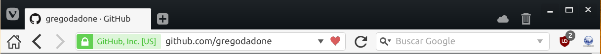

# Vivaldi Simple UI
A more simple and comfortable UI layout for Vivaldi browser.



## Features
### Elements order
1. Home Button
2. Back Button
3. Forward Button
4. Address Bar
5. Reload Button
6. Search Bar
7. Extensions Wrapper

### Custom icons
* Home button
* Bigger Back and Forward buttons
* Bookmarks button

### How to install
#### Automatically (Linux only)
If you are in Linux, you can clone this repo and run *vivaldiPatcher-Linux.sh*
```
./vivaldiPatcher-Linux.sh
```
#### Manually
Go to Vivaldi installation folder
* __Linux:__ */opt/vivaldi/resources/vivaldi*
* __macOS:__ */Applications/Vivaldi.app/Contents/Versions/VERSION/Vivaldi/Framework.framework/Versions/A/Resources/vivaldi*
* __Windows:__
  * __User app:__ *C:\Users\USER\AppData\Local\Vivaldi\Application\VERSION\resources*
  * __System app:__ *C:\Program Files\Vivaldi\Application\VERSION\resources*
  
Copy *custom.css* inside style subfolder and *custom.js* into the root installation folder. Make a backup of *browser.html* and then edit it.
* Inside the head element add
```
<link rel="stylesheet" href="style/custom.css" />
```
* Inside the body element add
```
<script src="custom.js"></script>
```
* Save the file and you are done!

### How to uninstall
#### Automatically (Linux only)
If you want to uninstall the changes done by this program you can run
```
./vivaldiPatcher-Linux.sh -u
```
or
```
./vivaldiPatcher-Linux.sh --unpatch
```

### Program help
Get script usage information by running
```
./vivaldiPatcher-Linux.sh -h
```
or
```
./vivaldiPatcher-Linux.sh --help
```
