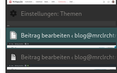

# Vivaldi Change Tab Color
I think there is not enough difference between the active and not active tab coler of the dark theme in vivald.
So this project changes the active tab color of the dark theme.

[You can find the german description here](https://mrclrchtr.de/vivaldi-hintergrundfarbe-des-aktiven-tabs-aendern/)



### How to install
#### Automatically (Linux only)
If you are in Linux, you can clone this repo and run *vivaldiPatcher-Linux.sh*
```
./vivaldiPatcher-Linux.sh
```
#### Manually
Go to Vivaldi installation folder
* __Linux:__ */opt/vivaldi/resources/vivaldi*
* __macOS:__ */Applications/Vivaldi.app/Contents/Frameworks/Vivaldi Framework.framework/Versions/VERSION/Resources/vivaldi*
* __Windows:__
  * __User app:__ *C:\Users\USER\AppData\Local\Vivaldi\Application\VERSION\resources*
  * __System app:__ *C:\Program Files\Vivaldi\Application\VERSION\resources*

Copy *custom.css* inside style subfolder and *custom.js* into the root installation folder. Make a backup of *browser.html* and then edit it.
* Inside the head element add
```
<link rel="stylesheet" href="style/custom.css" />
```
* Inside the body element add
```
<script src="custom.js"></script>
```
* Save the file and you are done!

### How to uninstall
#### Automatically (Linux only)
If you want to uninstall the changes done by this program you can run
```
./vivaldiPatcher-Linux.sh -u
```
or
```
./vivaldiPatcher-Linux.sh --unpatch
```

### Program help
Get script usage information by running
```
./vivaldiPatcher-Linux.sh -h
```
or
```
./vivaldiPatcher-Linux.sh --help
```

# Extended version for Arch Linux
After every update, you have to redo the steps above. To do this automatically, you can install a pacman hook (vivaldi-patch.hook) in arch.
The install patch-patch-hook.sh does this automatically. You can run it with or without a destination directory:
```
./install-patch-hook.sh
```
or
```
./install-patch-hook.sh /path/to/install
```
Default is /opt/vivaldi-patch
